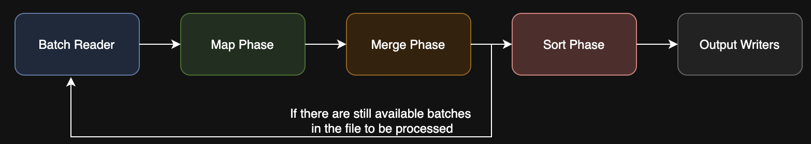
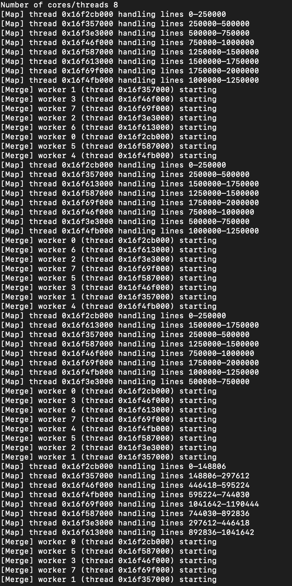
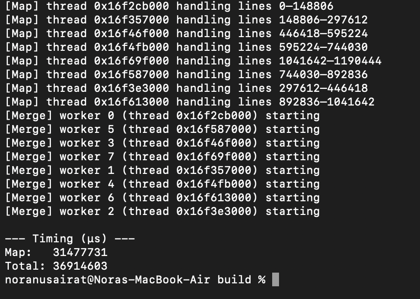
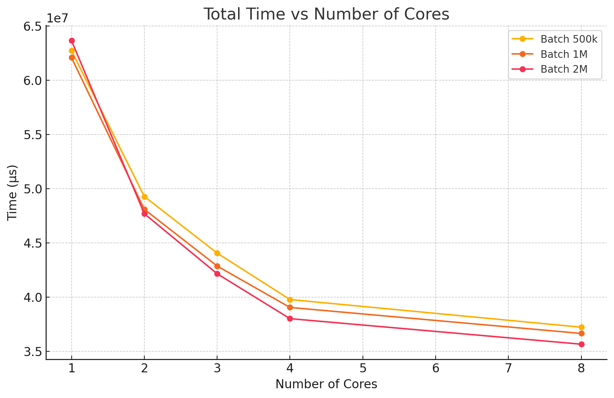
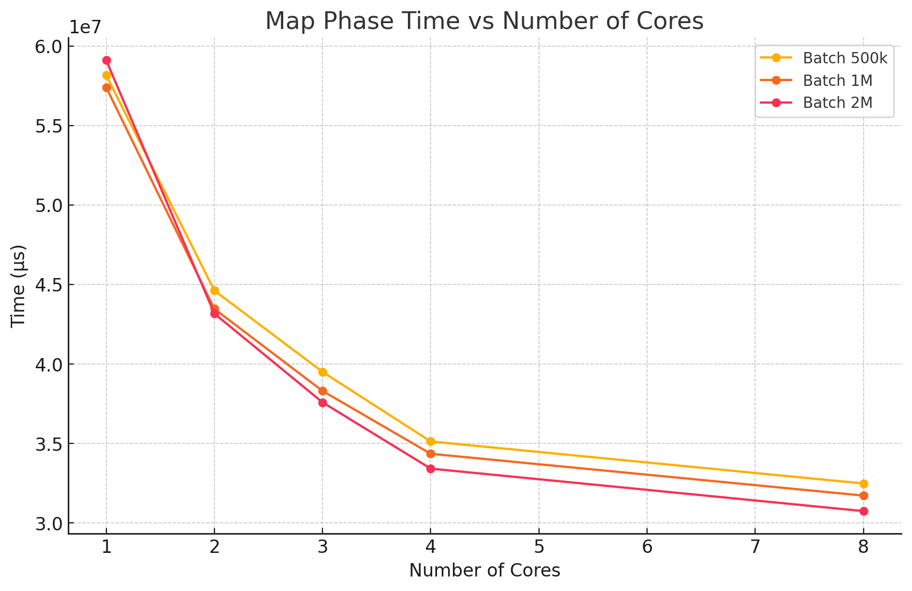
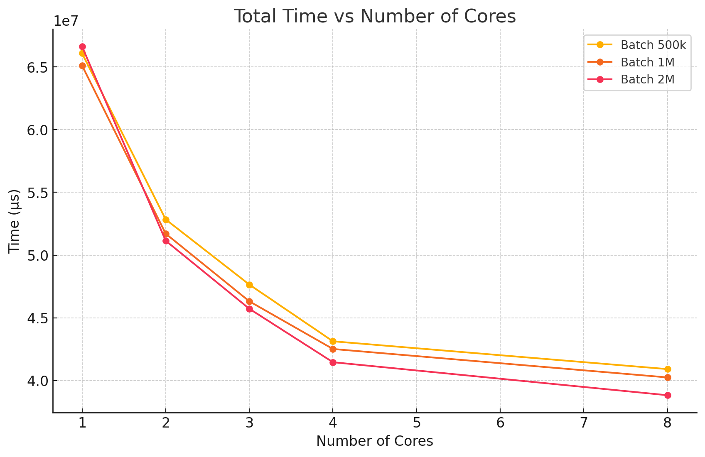
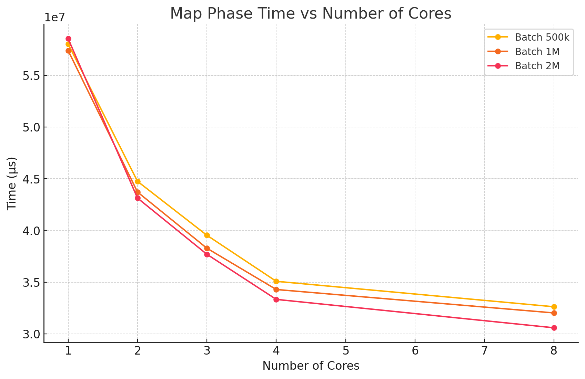

## Kindly refer to the presentation for the demo. 


# Parallel Map-Reduce Word Counter for One Machine


A lightweight C++17 application that reads a large UTF-8 text file in fixed-size batches, counts how often each word appears (skipping digits, hyphens, etc.), and writes two sorted outputs:

- **`output.txt`**: words in alphabetical order (A → Z)  
- **`output2.txt`**: words sorted by descending frequency 

---

## 📋 Prerequisites

- A C++17-compatible compiler (e.g. `g++`)  
- [CMake]
- UNIX-style shell (macOS, Linux) or WSL on Windows  

---

## 🛠️ Building

```bash
git clone <https://github.com/MohdFawaz/parallel-map-reduce-word-counter-for-one-machine.git>
cd project_directory
mkdir build && cd build
cmake ..
make
```
## Usage
./wordcount path/to/input.txt


## Input File 
The input of the programs is the fiwiki-latest-pages-articles_preprocessed.txt file containing
some content of Finnish pages from Wikipedia. The file size is about 700MB, contains about 7
million lines and 700 million characters.
Link: https://abofi-my.sharepoint.com/:f:/g/personal/adnan_ashraf_abo_fi/En1SINSJddFOhz_WuEYV-ZoBHK7Ju7X24eN_mOf9rZN9Hg?e=Cjngg0 
Note: People in Åbo Akademi O365 with the link can view and download the above datasets.

In case you couldn't download it from the previous link, try here: https://drive.google.com/drive/folders/1EQI671TRsXpCYQfEBIQggS99YbOG16Wr?usp=sharing

## How It Works

1. **Configuration**  
   - Setting `threadCount`: number of threads used for both map and merge phases via std::thread::hardware_concurrency() or manually.
   - `BATCH_SIZE`: number of lines read into memory at once
  
   

3. **Batch Reading**
   - When reading large files at once, a segmentation error false as there could be no enough space in memory, thus we divide our file into batch, each batch has a specific number of lines that is defined in code.  
   - Read lines into a `batch` vector until its size reaches `BATCH_SIZE`  
   - Pause reading and process the full batch before continuing (we selected the size of 2 million lines)
        As soon as batch.size() == BATCH_SIZE, pause reading and process this chunk

   
     
4. **Map Phase**  
   - Split each batch evenly across N “map” threads  
   - Each thread runs `countWordsInChunk()`:
     - Scans characters in its line range  
     - Builds words from letters only (ASCII + Finnish), skipping digits, hyphens, spaces  
     - Updates a **local** `unordered_map<string, size_t>` with word counts
    
   

5. **Merge Phase (Shuffle + Reduce)**  
   - Spawn N “merge” threads  
   - Each thread takes a subset of the local maps (round-robin by map index)  
   - For each `(word, count)`:
     1. Hash the word to select a stripe number  
     2. Lock only that stripe’s mutex  
     3. Add the count into the shared `globalCounts` map
    
      

6. **Sorting**
   - After all batches are processed (the whole file is processed) then we proceed with this step
   - Collect all `(word, count)` entries from `globalCounts` into a `vector<pair<string,size_t>>`  
   - Run a parallel merge-sort twice:
     - First by word (A → Z) → write **output.txt**  
     - Then by count descending → write **output2.txt**  

8. **Timing & Logging**  
   - Measure map-phase and total runtime (map + merge + sort) in microseconds  
   - Print thread assignments and timing to the console  


## Parallelism Utilization

We leverage all available CPU threads in each major stage:

1. **Map Phase**  
   - Query `N = std::thread::hardware_concurrency()`  
   - Spawn N threads, each counting words in its own slice of the batch  
   - All threads run concurrently until every line is processed  

2. **Merge Phase**  
   - Re-use `N` threads to combine per-thread maps into `globalCounts`  
   - Each thread handles a disjoint subset of maps (by `i % N == threadId`)  
   - Striped locking (`hash(word)%N`) lets most threads update in parallel  

3. **Sort Phase**  
   - `parallelMergeSort` splits the vector in two, spawning one extra thread per split  
   - Recurses until subranges are small or depth > N, then falls back to `std::sort`  
   - Ensures up to N threads are sorting different parts simultaneously  

By matching thread-count to hardware cores in each phase, we keep all cores busy and minimize idle time as shown here: 






## Performance Results

### After implementing the parallel Sort Algorithm
| Cores | 500 k Total (µs) | Speedup      | 1 M Total (µs) | Speedup      | 2 M Total (µs) | Speedup      |
|:-----:|------------------:|:-------------|---------------:|:-------------|---------------:|:-------------|
| 1     |      62,717,443   | 1.00× ( 0% )  |     62,080,693  | 1.00× ( 0% ) |     63,649,276  | 1.00× ( 0% )  |
| 2     |      49,268,472   | 1.27× (21%)  |     48,085,109  | 1.29× (23%)  |     47,679,586  | 1.33× (25%)  |
| 3     |      44,046,881   | 1.42× (30%)  |     42,855,138  | 1.45× (31%)  |     42,143,414  | 1.51× (34%)  |
| 4     |      39,765,492   | 1.58× (37%)  |     39,035,370  | 1.59× (37%)  |     38,002,453  | 1.67× (41%)  |
| 8     |      37,212,383   | 1.68× (41%)  |     36,637,550  | 1.69× (41%)  |     35,646,053  | 1.79× (44%)  |


Note in y-axis that you should multiply the value x10 to get it in seconds, so if you see for example 5.5, it means 5.5 x 10 = 55 secs.




## Not very important, but that was the table with single-threaded sorting algorithm for the output 
### using single-threaded Sort (baseline)
| Cores | 500 k Total (µs) | Speedup      | 1 M Total (µs) | Speedup      | 2 M Total (µs) | Speedup      |
|:-----:|------------------:|:-------------|---------------:|:-------------|---------------:|:-------------|
| 1     |      66,076,306   | 1.00× ( 0% )  |     65,104,255  | 1.00× ( 0% ) |     66,616,403  | 1.00× ( 0% )  |
| 2     |      52,840,261   | 1.25× (20%)  |     51,706,488  | 1.26× (21%)  |     51,144,588  | 1.30× (23%)  |
| 3     |      47,650,680   | 1.39× (28%)  |     46,316,855  | 1.41× (29%)  |     45,723,997  | 1.46× (31%)  |
| 4     |      43,129,485   | 1.53× (35%)  |     42,516,748  | 1.53× (35%)  |     41,462,567  | 1.61× (38%)  |
| 8     |      40,913,860   | 1.62× (38%)  |     40,250,688  | 1.62× (38%)  |     38,832,172  | 1.72× (42%)  |





## Performance Analysis

### Scaling Behavior
- **Near-linear speedup up to 4 cores**  
  - 1 → 2 threads cuts total time by ~25–30 %.  
  - 2 → 3 threads adds another ~10–15 %.  
  - 3 → 4 threads still yields ~10–15 % improvement.  
- **Diminishing returns beyond 4 cores**  
  - 4 → 8 threads only gains an extra ~5–10 %.  
  - Overhead from thread management, locking and sorting begins to dominate.  
- **Batch-size impact**  
  - Smaller batches (500 k lines) pay proportionally higher thread-startup and merge overhead → slightly lower speedups.  
  - Larger batches (1 M–2 M lines) amortize those costs better, so map phase scales well but merge & sort still limit total gains.

### Overhead Breakdown
- **Map Phase**  
  - Highly parallel and nearly lock-free → almost linear scaling.  
- **Merge Phase**  
  - Uses striped locking to reduce contention, but hot keys and mutex overhead still serialize updates.  
- **Parallel Sort**  
  - Spawns threads and merges subranges; overhead grows with more threads and smaller subarrays.

### Takeaways
- **Sweet spot at 4–6 threads** for most batch sizes: best cost-to-performance tradeoff.  
- **Beyond 6 threads** adds minimal benefit; may even slightly slow down due to synchronization and cache contention.  
- **Tuning opportunities**  
  - Increase stripe count or use lock-free reduction to further reduce merge contention.  
  - Adjust `BATCH_SIZE` to balance map throughput vs. merge cost.  

## definitions 
Contention: when two or more threads try to modify the same data (or grab the same lock) at once, they “fight” and one must wait.

Striped locking: We split our global map into several independent buckets (stripes), each with its own mutex, so threads only collide if they touch the same stripe.

Hot keys: very common words all hash to the same stripe → many threads queue on that one mutex.

Mutex overhead serializes updates: if Thread A holds a stripe’s lock, Threads B,C… must wait; those increments happen one at a time.

## Justification for some of the choices made
We chose stripe-level locking because:

Far fewer locks to manage: creating a mutex for every possible word (map element) would be huge overhead (memory + initialization cost).

Reduced bookkeeping: with, say, 8 or 16 stripes we only need that many mutexes, not millions.

Good contention balance: stripes spread hot keys across buckets so unrelated words rarely collide, yet you avoid the cost of per-element mutexes.

If we locked each element we would pay a heavy memory and performance penalty just to track all those mutexes, even though merge itself could still serialize on very hot words.
